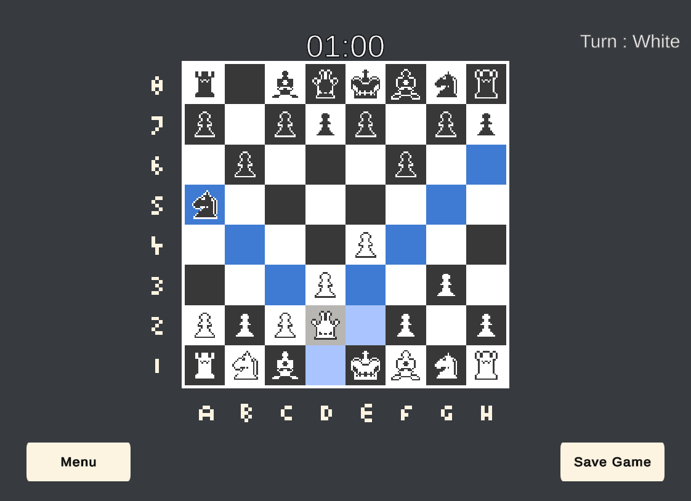
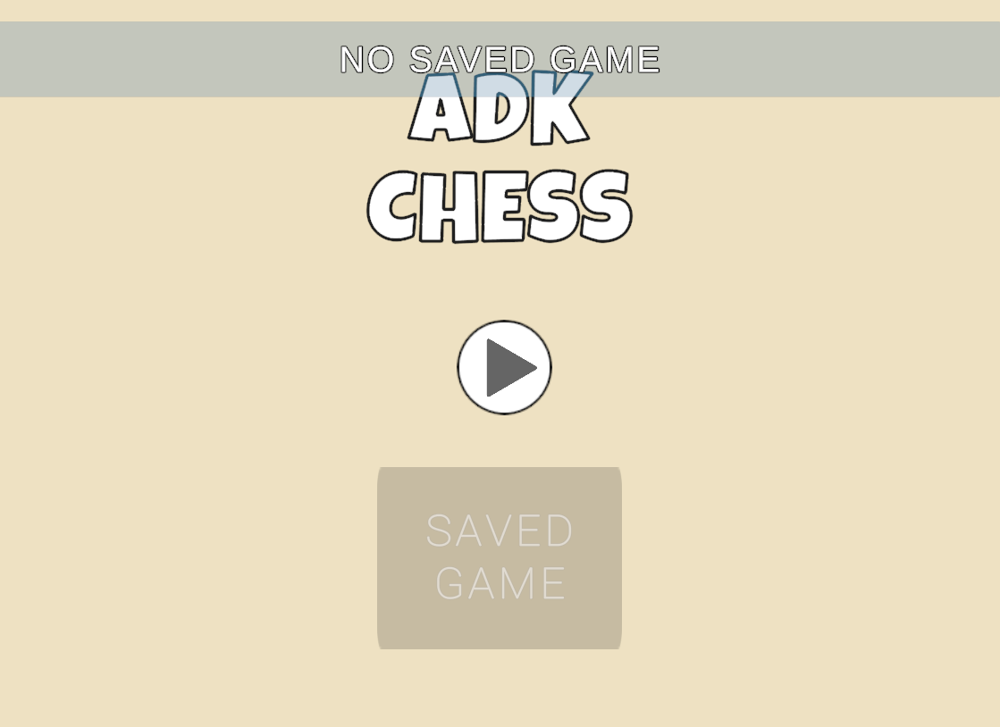
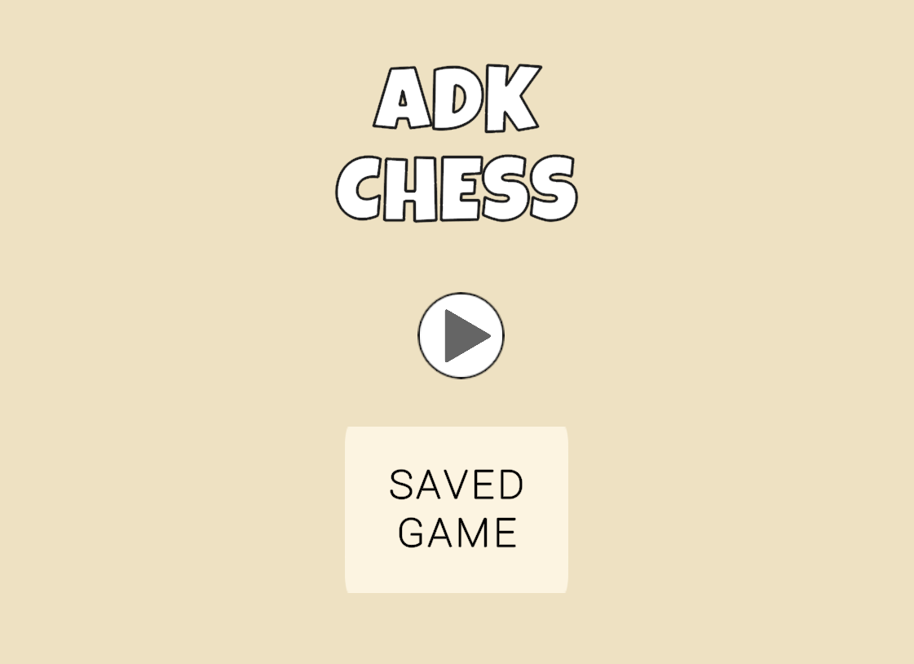
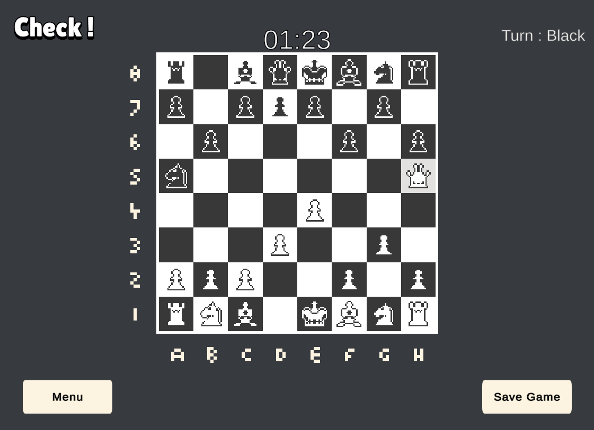
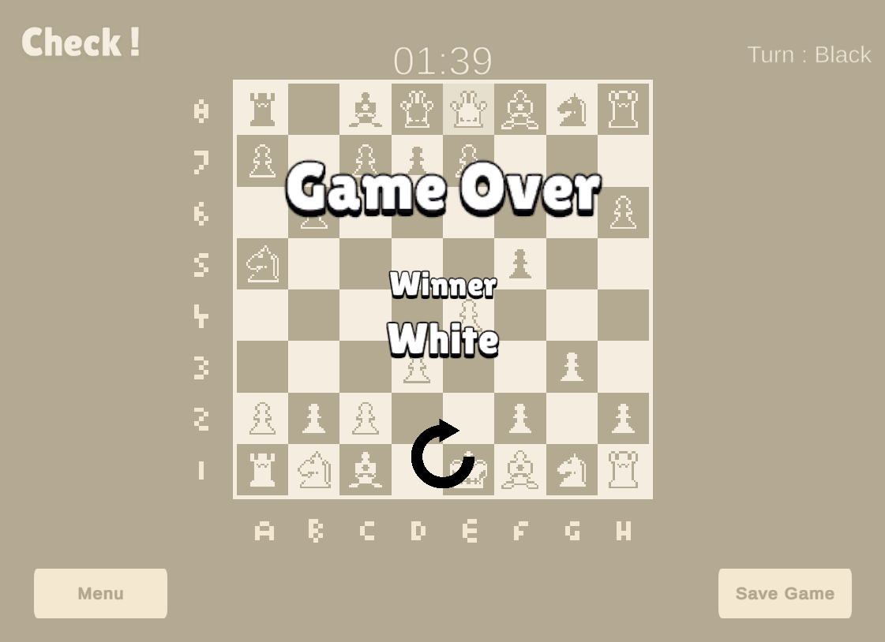

# Unity 2D Chess
 

    

 

## Introduction

This project is a simple 2D Chess game made in Unity. It is a **two player** chess game, meaning there is **NO AI**. Special moves such as; castling, pawn promotion, en passant capture do **NOT** exist in this game. The game forces you to only be able to make legal moves.

    
    
    
    

## Installation

To run the Cube Runner game on your Windows system, follow these steps:

&nbsp;&nbsp;&nbsp; 1. Clone this repository or download it as a ZIP file.  
&nbsp;&nbsp;&nbsp; 2. Open the project in Visual Studio or your preferred C++ IDE.  
&nbsp;&nbsp;&nbsp; 3. Build and run the project.    

### Downloading Release and Playing

You can easily download and play the game by following these steps:

&nbsp;&nbsp;&nbsp; 1. Go to the [Releases](https://github.com/AnastasyaDuygu/Basic-2D-Chess/releases) section of this repository.  
&nbsp;&nbsp;&nbsp; 2. Find the latest release and click on it.  
&nbsp;&nbsp;&nbsp; 3. Download the ` v1.0.0.zip ` file from the release.  
&nbsp;&nbsp;&nbsp; 4. Unzip the zip file.    
&nbsp;&nbsp;&nbsp; 5. Run ` 2D Chess` application file to start playing the game !  

## Features

- On the start menu you can either **start a new game** by pressing the play button **or**, if you have a previously saved game you can **continue playing** that game by pressing the saved game button.
- If you do NOT have a previously saved game, saved game button will be deactivated.
- While playing the game there is a **timer** present on the screen **and** also a text on the top right corner **indicating** whose **turn** it is currently.
- Players can only move their pieces when it is their turn.
- While playing the game, the player can **return to menu page at any time** by using the **menu button** on the bottom left corner.
- The player can **save their current game** by pressing the **save game button** located on the bottom right corner of the screen.
- This game was made to **fit any display resolution**.
- When a player wins, a **screen indicating** which **player won** the game shows up **and** player can press the **replay button** to play again.
- **Hovering over tiles** changes their **color**.
